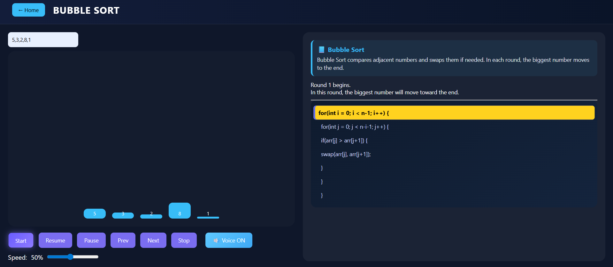

# AlgoVision AI

AlgoVision AI is an interactive platform designed to help students understand Data Structures and Algorithms through visual learning.

The platform visualizes algorithms step-by-step so that users can observe how data changes during execution.

## Features

• Algorithm visualization using animated bars  
• Step-by-step explanation of algorithm operations  
• Start, Pause, Resume, Next, and Previous controls  
• Adjustable animation speed  
• Voice narration explaining each step  
• Level-based learning (Beginner, Intermediate, Pro)

## Algorithms Implemented

Sorting:
- Bubble Sort
- Insertion Sort
- Selection Sort
- Merge Sort
- Quick Sort

Searching:
- Linear Search
- Binary Search

Advanced:
- Graph Traversal
- Dynamic Programming

## Future Work

The next version of the platform will integrate an LLM-based assistant capable of:
- explaining algorithm behavior
- answering user questions
- recommending suitable algorithms for different problems

## Technologies Used

- HTML
- CSS
- JavaScript
- C++

## Visualization Example

